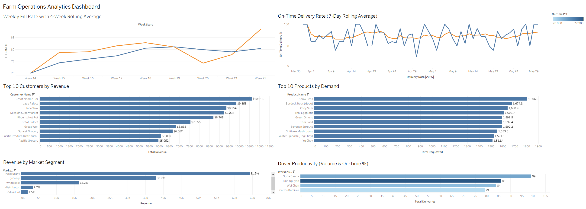
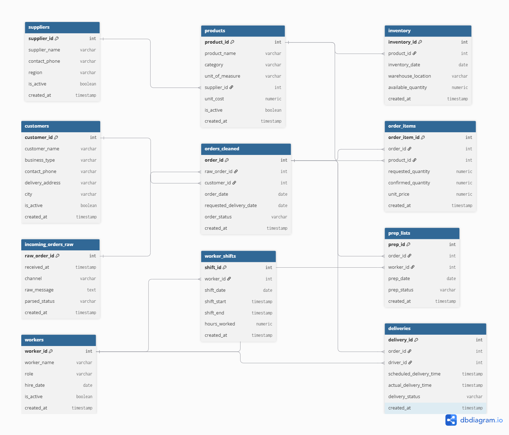

# Farm Operations Analytics

An end-to-end analytics project modeling operations for a Bay Area produce distribution business — from messy order intake through fulfillment, delivery, and labor tracking. Built with PostgreSQL, Python, and Tableau.

**🔗 [View the live Tableau dashboard](https://public.tableau.com/app/profile/chris.tsoi/viz/FarmOperationsAnalyticsDashboard/KPIDashboard)**



---

## Overview

This project models a produce distribution workflow for a wholesale/retail supplier. Customer orders arrive in inconsistent formats (SMS, email, phone notes), get cleaned and standardized, checked against inventory, confirmed, prepared, scheduled for delivery, and tracked alongside driver labor. The goal is operational visibility: fill rates, delivery performance, product demand, customer concentration, and driver productivity.

All data is synthetically generated to model realistic operational patterns. It does not represent a real company.

---

## Operational Workflow

The model follows a real produce distribution process end to end:

1. Market order submission (raw, inconsistent formats)
2. Order intake and cleaning
3. Inventory availability check
4. Order confirmation
5. Prep list generation
6. Delivery scheduling
7. Worker hours and labor tracking
8. Operational dashboard reporting

---

## Key Findings

- **Overall order fill rate of 78%** — roughly 1 in 5 requested units went unfulfilled, indicating supply/inventory pressure worth investigating.
- **Revenue is highly concentrated:** restaurants (51.9%) and grocery (30.7%) together drive ~83% of revenue, while individual buyers contribute under 2%. A classic Pareto distribution with clear implications for account prioritization.
- **Daily on-time delivery is volatile (25%–100%) but stabilizes around 75% on a 7-day rolling basis** — showing why smoothed metrics matter more than raw daily numbers for operational decisions.
- **Top products by demand** are dominated by leafy greens and specialty vegetables (Snow Peas, Choy Sum, Gobo), useful for inventory planning.
- **Driver productivity varies in both volume and quality** — the highest-volume driver isn't the highest on-time performer, surfacing a coaching/allocation insight.

---

## Data Model

11-table dimensional model (Kimball-style) with a raw → cleaned staging layer for order intake.



**[View the interactive ERD on dbdiagram.io](https://dbdiagram.io/e/6a60ef8c067336e1ded27494/6a60f0b6c3a90dd98d94c6d3)**

- **Dimensions:** customers, suppliers, workers, products
- **Facts:** incoming_orders_raw, orders_cleaned, order_items, inventory, prep_lists, deliveries, worker_shifts
- **Staging pattern:** raw customer messages land in `incoming_orders_raw`, then parse into structured `orders_cleaned` with a foreign key back to the source — mirroring real ELT practice.

Full design rationale, tradeoffs, and known data-quality notes are documented in [`docs/decisions.md`](docs/decisions.md).

---

## Analytics

The analytics layer includes 13 KPI queries ([`sql/analytics/kpi_queries.sql`](sql/analytics/kpi_queries.sql)) covering:

- **Fulfillment & delivery:** fill rate with 4-week rolling average, on-time delivery with 7-day volume-weighted rolling rate
- **Customer analytics:** top customers, revenue by market segment, NTILE quartile segmentation (Pareto)
- **Product & inventory:** demand/shortage ranking, source-type performance, inventory trend by category
- **Labor:** driver productivity ranking with window functions

Techniques used: CTEs, window functions (rolling averages, `RANK`, `NTILE`), conditional aggregation, and `NULLIF` guards for safe division. Six of these queries are visualized in the dashboard.

---

## Tech Stack

- **PostgreSQL** — dimensional schema, constraints, indexing
- **Python** (psycopg2, python-dotenv, Faker) — idempotent data generation pipelines
- **Tableau Public** — interactive dashboard
- **dbdiagram.io** — ERD from live schema

---

## Repository Structure
```
├── data/
│   ├── raw/               raw generated order data
│   └── processed/         cleaned data
├── sql/
│   ├── schema/            create_tables.sql, indexes.sql
│   ├── seed/              insert_sample_data.sql
│   └── analytics/         kpi_queries.sql
├── scripts/               Python generation pipelines
├── docs/                  decisions.md, project_scope..md, schema.md, workflow.md
├── dashboard/             Tableau workbook + exported CSVs
├── images/                dashboard + ERD screenshots
└── README.md
```

---

## Running It Locally

1. Clone the repo and create a `.env` file with your Postgres credentials.
2. Create the schema:
```
psql -f sql/schema/create_tables.sql
psql -f sql/schema/indexes.sql
```

3. Generate data by running the scripts in `scripts/` in dependency order — dimensions first, then facts:

```
python scripts/generate_customers.py
python scripts/generate_suppliers.py
python scripts/generate_workers.py
python scripts/generate_products.py
python scripts/generate_raw_orders.py
python scripts/generate_orders_cleaned.py
python scripts/generate_order_items.py
python scripts/generate_inventory.py
python scripts/generate_deliveries.py
```

4. Run the KPI queries in `sql/analytics/kpi_queries.sql`.
5. The Tableau dashboard reads from the exported CSVs in `dashboard/tableau_data/`.

---

## Documentation

- [`docs/decisions.md`](docs/decisions.md) — design decisions, tradeoffs, and known data-quality notes
- [`docs/project_scope.md`](docs/project_scope.md) — scope, objectives, and MVP boundaries
- [`docs/schema.md`](docs/schema.md) — full table definitions, relationships, and field-level data dictionary
- [`docs/workflow.md`](docs/workflow.md) — operational workflow the model represents

---

## Notes & Next Steps

- Data uses uniform random generation; a v2 would add weighted business distributions (seasonal demand, customer-type order frequency) for more realistic trends.
- A dbt transformation layer is a planned next step to formalize the staging → marts modeling currently done in SQL.


